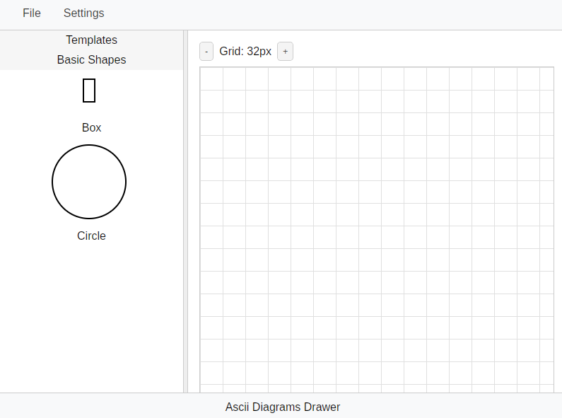

# Ascii Diagram Drawer

An editor drawing ascii art diagrams which are compatible with svg bob.

**Attention!**: This project is still in a very early stage.

# Setup
## Techstack: Rust + Tauri + Protobuf + SvelteKit
- Rust+Tauri - Backend
- Protobuf for typesafe messaging between Front and Backend
- Typescript+SvelteKit for frontend

## Build dependencies

- [Vite](https://vitejs.dev/) - A build tool that makes it easy to create modern web applications.
- [Tauri](https://tauri.app/) - A framework for building cross-platform desktop applications.
- Protobuf Compiler: apt install -y protobuf-compiler
- npm install --save-dev ts-proto

## Recommended IDE Setup

[VS Code](https://code.visualstudio.com/) + [Svelte](https://marketplace.visualstudio.com/items?itemName=svelte.svelte-vscode) + [Tauri](https://marketplace.visualstudio.com/items?itemName=tauri-apps.tauri-vscode) + [rust-analyzer](https://marketplace.visualstudio.com/items?itemName=rust-lang.rust-analyzer).
